# Database Partitioning
## 1. Horizontal Partition (Row-based  Sharding)
Khái niệm  
Chia dữ liệu theo hàng (row). Mỗi partition có cùng cấu trúc bảng nhưng chứa các dòng khác nhau.
### Ví dụ
Bảng `Users`

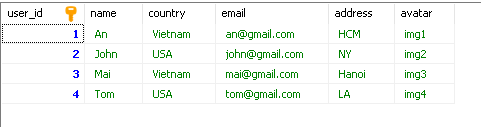

### Partition
- Chia làm 2 Partition (sharding theo country)
- Partition 1 (Vietnam)  
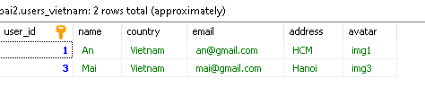

- Partition 2 (USA)  
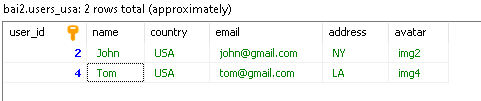

### Lợi ích
- Dễ dàng thêm server để xử lý dữ liệu lớn
- Query chỉ chạy trên một partition thay vì toàn bộ bảng
- Giảm áp lực lên một database duy nhất
- Tăng khả năng chịu lỗi (Một shard lỗi không ảnh hưởng toàn hệ thống)

### Phù hợp
- Dữ liệu rất lớn

---

## 2. Vertical Partition (Column-based)

Khái niệm  
Chia dữ liệu theo cột (column). Mỗi partition chứa một phần cột của bảng.

### Ví dụ

Bảng `Users` có các thuộc tính

### Partition

- Partition 1 (Core data)  

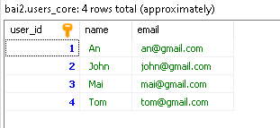 

- Partition 2 (Less-used data)  

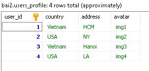 

### Lợi ích
- Chỉ truy vấn những cột cần thiết
- Bảng nhẹ hơn → xử lý nhanh hơn
- Dữ liệu quan trọng được load nhanh
- Tách dữ liệu nhạy cảm / ít dùng

### Phù hợp
- Bảng có nhiều cột
- Một số cột ít được truy cập

---

## 3. Functional Partition (Logic-based  Service-based)

Khái niệm  
Chia dữ liệu theo chức năng (business logic).

### Ví dụ hệ thống e-commerce

- User Service DB  

 

- Profile Service DB  
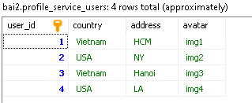 

### Lợi ích
- Áp dụng trong kiến trúc microservices (Triển khai, deploy độc lập)
- Giảm coupling giữa các module
- Dễ maintain & phát triển (Mỗi service quản lý DB riêng)
- Scale độc lập từng phần

### Phù hợp
- Hệ thống lớn
---

## Tổng kết

- Horizontal → scale dữ liệu lớn
- Vertical → tối ưu hiệu năng truy vấn
- Functional → tổ chức hệ thống theo domain

# Service-Based Architecture

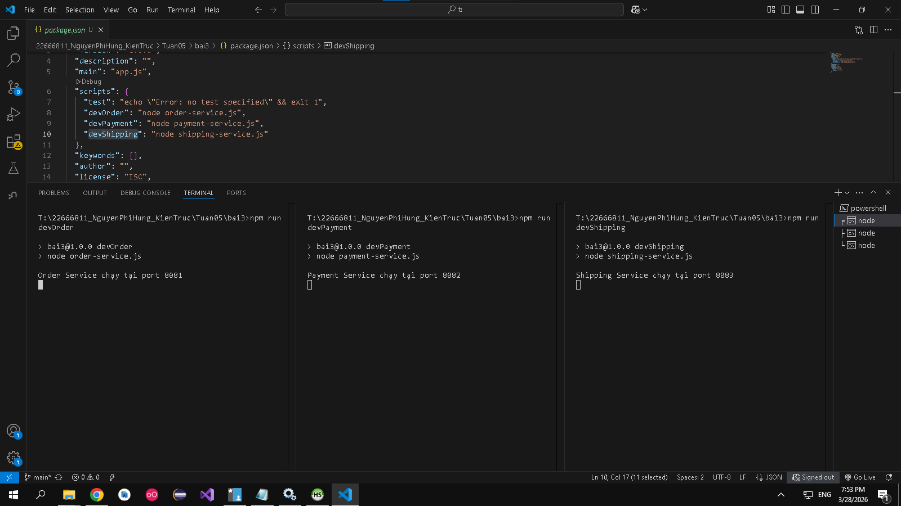 
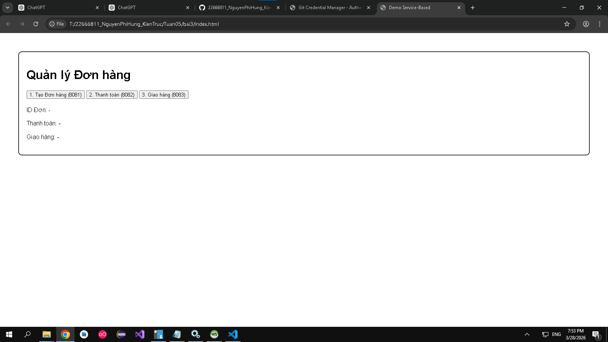 
 
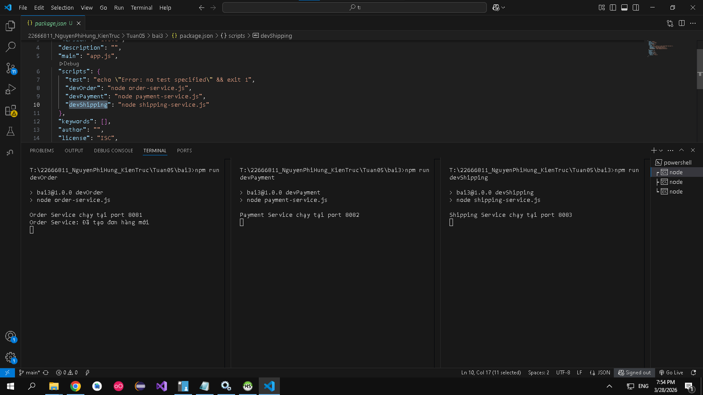 
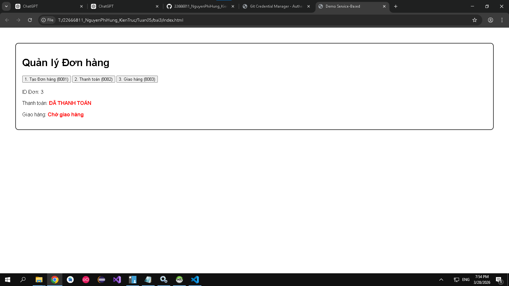 
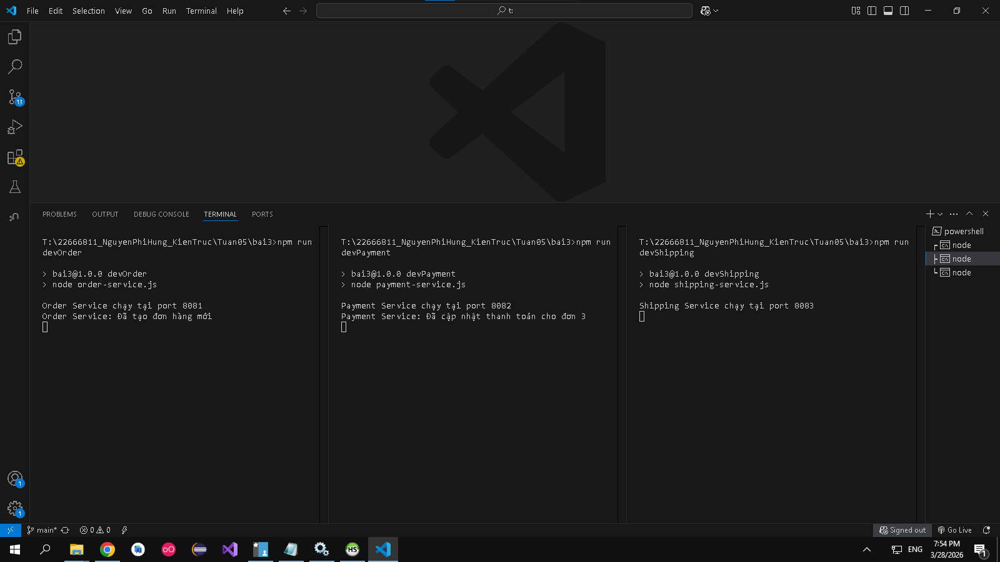
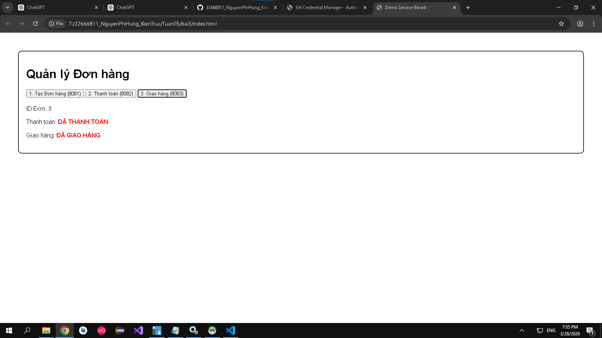 
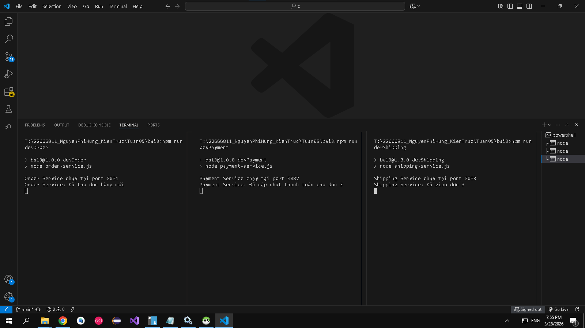  