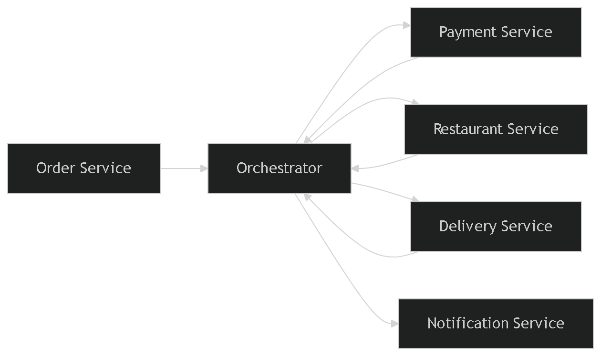
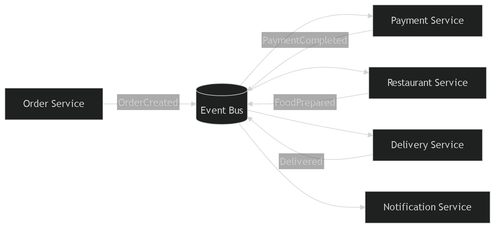

# Database Partitioning
## 1. Horizontal Partition (Row-based  Sharding)
Khái niệm  
Chia dữ liệu theo hàng (row). Mỗi partition có cùng cấu trúc bảng nhưng chứa các dòng khác nhau.
### Ví dụ
Bảng `Users`

### Partition
- Chia làm 2 Partition (sharding theo country)
- Partition 1 (Vietnam)  

- Partition 2 (USA)  

### Lợi ích
- Dễ dàng thêm server để xử lý dữ liệu lớn
- Query chỉ chạy trên một partition thay vì toàn bộ bảng
- Giảm áp lực lên một database duy nhất
- Tăng khả năng chịu lỗi (Một shard lỗi không ảnh hưởng toàn hệ thống)

### Phù hợp
- Dữ liệu rất lớn

---

## 2. Vertical Partition (Column-based)

Khái niệm  
Chia dữ liệu theo cột (column). Mỗi partition chứa một phần cột của bảng.

### Ví dụ

Bảng `Users` có các thuộc tính

### Partition

- Partition 1 (Core data)  

 

- Partition 2 (Less-used data)  

 

### Lợi ích
- Chỉ truy vấn những cột cần thiết
- Bảng nhẹ hơn → xử lý nhanh hơn
- Dữ liệu quan trọng được load nhanh
- Tách dữ liệu nhạy cảm / ít dùng

### Phù hợp
- Bảng có nhiều cột
- Một số cột ít được truy cập

---

## 3. Functional Partition (Logic-based  Service-based)

Khái niệm  
Chia dữ liệu theo chức năng (business logic).

### Ví dụ hệ thống e-commerce

- User Service DB  

 

- Profile Service DB  
 

### Lợi ích
- Áp dụng trong kiến trúc microservices (Triển khai, deploy độc lập)
- Giảm coupling giữa các module
- Dễ maintain & phát triển (Mỗi service quản lý DB riêng)
- Scale độc lập từng phần

### Phù hợp
- Hệ thống lớn
---

## Tổng kết

- Horizontal → scale dữ liệu lớn
- Vertical → tối ưu hiệu năng truy vấn
- Functional → tổ chức hệ thống theo domain

# Service-Based Architecture

 
 
 
 
 

 
  

# Event Choreography vs Orchestration

## 1. Tổng quan

Trong kiến trúc microservices, hai cách phổ biến để điều phối luồng xử lý (workflow) là:

* **Orchestration (Điều phối tập trung)**: Có một service trung tâm (orchestrator) chịu trách nhiệm điều khiển toàn bộ workflow.
* **Choreography (Điều phối phân tán)**: Các service tự phản ứng với event mà không có “nhạc trưởng” trung tâm.

Bài toán áp dụng: **Workflow đặt đơn thực phẩm (Food Ordering System)**.

## Orchestration (Điều phối tập trung)

### Ưu điểm

* **Dễ hiểu, dễ debug**
* **Logic tập trung rõ ràng**
* **Kiểm soát tốt flow (retry, rollback, timeout)**
* Phù hợp với workflow phức tạp (Saga orchestration)

### Nhược điểm

* **Single point of failure (SPOF)** nếu orchestrator lỗi
* Khó scale nếu orchestrator quá tải
* Coupling cao (các service phụ thuộc orchestrator)
* Thay đổi workflow cần sửa orchestrator

---
## Choreography (Điều phối phân tán)

### Ưu điểm

* **Loose coupling (giảm phụ thuộc)**
* **Dễ scale theo từng service**
* Không có điểm nghẽn trung tâm
* Phù hợp hệ thống event-driven

### Nhược điểm

* **Khó debug (flow phân tán)**
* Khó theo dõi trạng thái end-to-end
* Dễ bị **event chaining phức tạp**
* Xử lý lỗi và rollback khó hơn

---

## Thiết kế cho Scaling & Resilience

### Khi cần scaling mạnh

Chọn **Choreography** khi:

* Lượng order lớn (high throughput)
* Cần scale từng service độc lập
* Hệ thống phân tán (multi-region)

→ Vì không có bottleneck trung tâm

---

### Khi cần kiểm soát chặt chẽ

Chọn **Orchestration** khi:

* Workflow phức tạp (nhiều nhánh, điều kiện)
* Cần tracking rõ ràng (audit, compliance)
* Business logic thay đổi ít

---

### Resilience (khả năng chịu lỗi)

| Tiêu chí          | Orchestration                 | Choreography          |
| ----------------- | ----------------------------- | --------------------- |
| Failure isolation | Thấp (orchestrator ảnh hưởng) | Cao                   |
| Retry logic       | Dễ implement                  | Phân tán, khó đồng bộ |
| Circuit breaker   | Tập trung                     | Mỗi service tự xử lý  |

--- 

## Kết luận

* **Orchestration**: phù hợp hệ thống cần kiểm soát chặt, dễ debug
* **Choreography**: phù hợp hệ thống lớn, cần scale và resilience cao