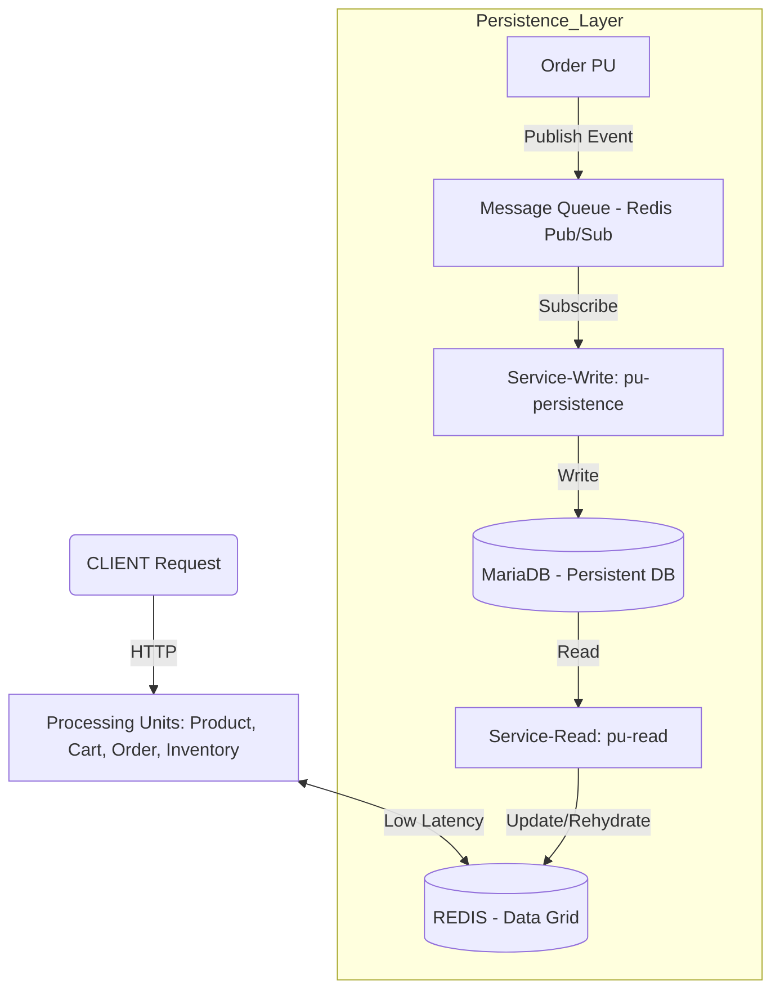

# Space-Based Architecture (SBA) - Flash Sale System

Dự án này triển khai kiến trúc **Space-Based Architecture (SBA)** nhằm tối ưu hóa hiệu năng cho các sự kiện Flash Sale (lượng truy cập cực lớn trong thời gian ngắn).

## 1. Thành phần cốt lõi

### A. Data Grid (Redis) - Nguồn dữ liệu thời gian thực
- Toàn bộ dữ liệu "nóng" (Sản phẩm, Kho, Giỏ hàng) được lưu trữ trên RAM bằng **Redis**.
- Cho phép các xử lý diễn ra với độ trễ cực thấp (mili giây).
- Đóng vai trò là trung tâm của hệ thống (Shared Space).

### B. Processing Units (PU) - Các đơn vị xử lý
- **PU1 - Product Service:** Cung cấp danh sách sản phẩm từ Redis.
- **PU2 - Cart Service:** Quản lý giỏ hàng tạm thời của người dùng trên Redis.
- **PU3 - Order Service:** Xử lý logic đặt hàng, trừ tồn kho và tạo đơn hàng.
- **PU4 - Inventory Service:** Quản lý số lượng tồn kho thời gian thực.

### C. Persistent Storage (MariaDB) - Lưu trữ bền vững
- Sử dụng **MariaDB** làm cơ sở dữ liệu lưu trữ lâu dài (Cold Storage).
- Đảm bảo dữ liệu không bị mất khi hệ thống sập hoặc Redis bị xóa.

## 2. Luồng hoạt động (Data Flow)

### Luồng Ghi (Write Flow) - Tách biệt để đạt tốc độ cao
1. **Client** gửi yêu cầu đặt hàng tới **PU3-Order**.
2. **PU3-Order** thực hiện các logic (trừ kho, tạo đơn) trực tiếp trên **Redis**.
3. Sau khi thành công trên Redis, **PU3-Order** bắn một "tin nhắn" (Message) vào kênh `order_created`.
4. Trả kết quả thành công cho **Client** ngay lập tức.
5. **Service-Write (pu-persistence)** lắng nghe tin nhắn và ghi dữ liệu vào **MariaDB** một cách bất đồng bộ (Asynchronous).

### Luồng Đọc (Read Flow)
- **Đọc nhanh:** Các PU đọc trực tiếp từ Redis để phục vụ Client.
- **Phục hồi (Rehydration):** Khi hệ thống khởi động, **Service-Read (pu-read)** sẽ đọc toàn bộ dữ liệu từ **MariaDB** và nạp ngược lại vào **Redis** để chuẩn bị cho giao dịch.
- **Lịch sử:** Dữ liệu cũ có thể được truy vấn trực tiếp từ MariaDB thông qua **Service-Read**.

## 3. Sơ đồ kiến trúc

## 4. Tại sao chọn kiến trúc này?
1. **Khả năng mở rộng (Scalability):** Có thể thêm nhiều PU mà không làm nghẽn Database trung tâm.
2. **Độ trễ thấp (Low Latency):** Bỏ qua các truy vấn I/O ổ đĩa chậm chạp trong quá trình giao dịch.
3. **Chống nghẽn (Load Shedding):** Database không bao giờ bị quá tải vì việc ghi được xử lý qua hàng đợi bất đồng bộ.
4. **Độ tin cậy:** Kết hợp giữa tốc độ của RAM (Redis) và sự bền vững của ổ đĩa (MariaDB).
